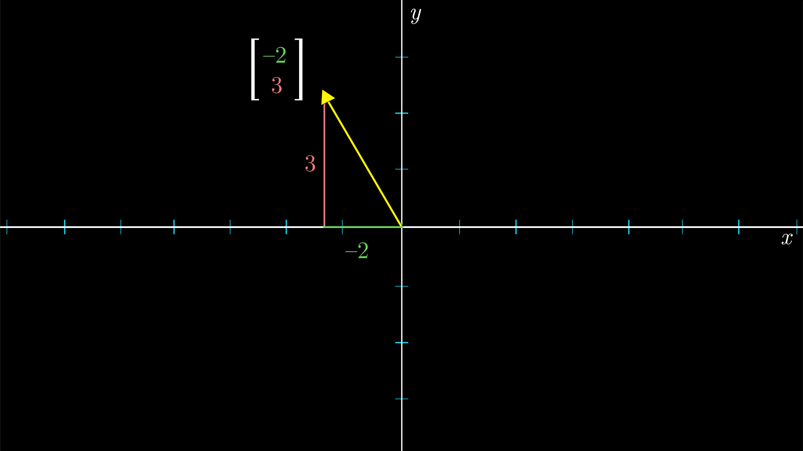
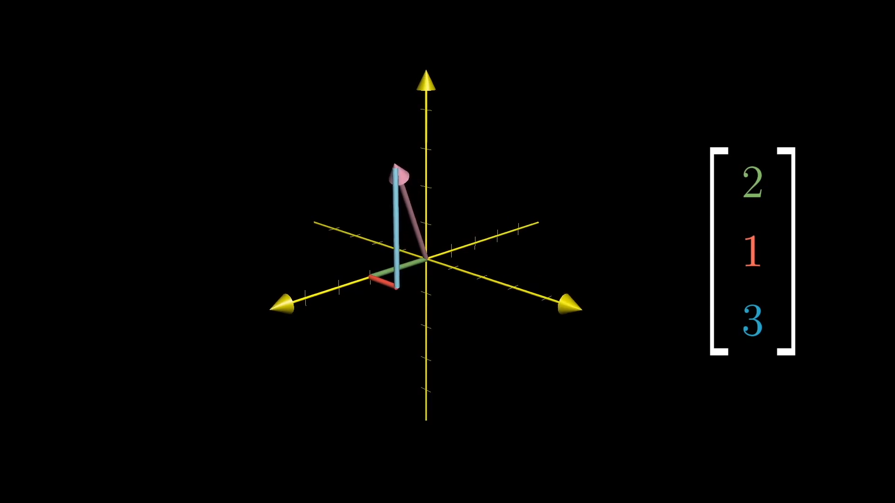
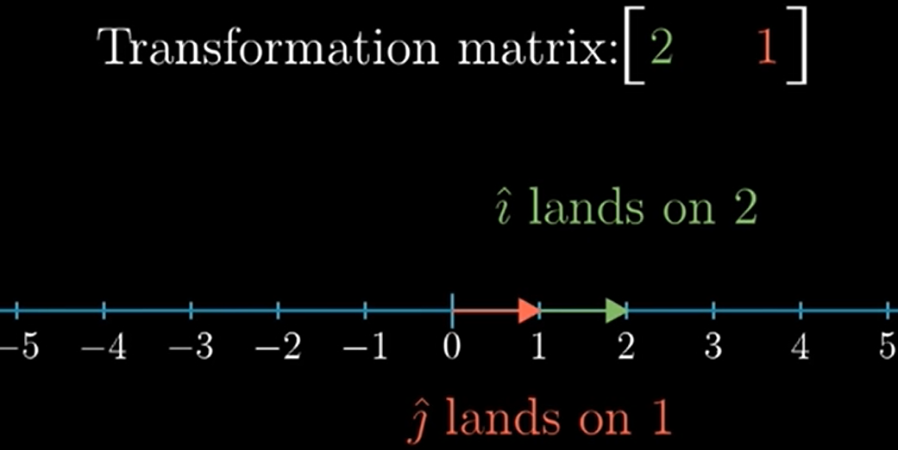

# Basics
How to Interpret the coordinate system
## Coordinate systems

"The introduction of numbers as coordinates is an act of violence."   
 - Hermann Weyl

The vector coordinates: **instructions** for how to get from the tail of that vector at the origin, to its tip.
- $1^{st}$ coordinate: how far to walk along the x-axis (right is + left is -);
- $2^{nd}$ coordinate: how far to walk along the y-axis (up is + down is -).

3D with third axis - perpendicular to both x and y axis. 

###  Vector Operations
*Addition* as a walk from the origin.

*Scaling*: stretching, squishing, and reversing direction.
