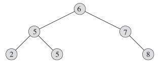

# Binary Search Tree
## 引子：Runway Reservation System
- Airpot with a single runway
-  Reserve req specify “requested landing time” t
-  Add t to the set if no other landings are scheduled within k minutes.
-  Remove t from set R after it lands
  
### Example

Request for time: 44 not allowed (46 ∈ R); 53 OK; 20 not allowed (already past)

##  Can we do better
- **Sorted array**: a k minute check can be done in O(1) but insertion(shifting) takes O(n).
- **Min heap**: insert in O(lgn) time but k minute check takes O(n) time
- **Sorted linked list**: cant do the binary search.

## BST 

**Binary-search-tree property**: Let x be a node in a binary search tree. 

If y is a node in the left subtree of x, then y.key <= x.key. 

If y is a node in the right subtree of x, then y.key >= x.key.

### Inorder tree walk
The binary-search-tree property allows us to print out all the keys in sorted order.
(Similarly, a **preorder tree walk** prints the root before the values in either subtree, and **a postorder tree walk** prints the root after the values in its subtrees.)

  
   
  <em> INORDER-TREE-WALK(T.root) </em> 

### Operations
*find(k)*, *find min()*, *insert(x)*, *next_larger(x)*(*successor*) and *delete()*.

- *find(k)*: Follow left and right pointers(binary search) until you find it or hit NIL.
- *find min( )*: keep going left until hit NIL
- *insert(x)*: two pointers - prev and current, follow left and right until current hit NIL
- *next_larger(x)*: find_min() if node x has a right subtree, or traverse up-left until reach a node y that is a left child, return y's parent.
- *deletion(x)*: tricky!
  - Case 1: x has no children. Just delete it (i.e. change its parent node so that it doesn’t point to
x).
  - Case 2: x has one child. Splice out x by linking x’s parent to x’s child.
  - Case 3: x has two children. Swap x with x’s successor and splice out x by linking x’s parent to x’s child.
Case 1 and Case 2 can be combined.

  **Special case**: Delete the root node
  1. create a sentinel node
  2. link the sentinel node with root
  3. delete self.root
  4. reassign sentinel.left to self.root 
  5. unlink the sentinel node   

  [Code](https://github.com/EeToSe/Algorithms/blob/main/src/data-structures/bst.py) and details [Binary Search Tree](BST.md)

## Unit_test
### Check representation invariant
The query operations offered by the data structure are guaranteed to produce the correct result, as long as the representation invariant **holds** (is true). Update operations are guaranteed to **preserve** the representation invariant (if the RI holds
before the update, it will also hold after the update).