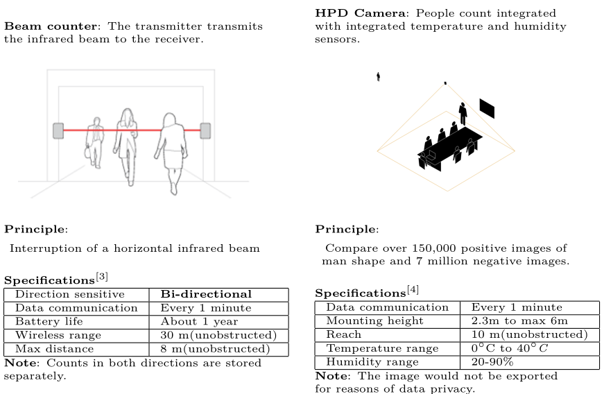
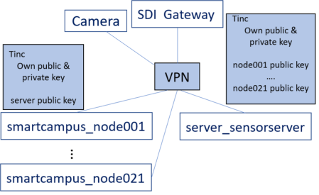
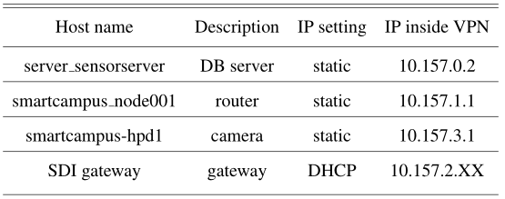

---
substitutions:
  key1: "I'm a **substitution**"
  key2: |
    ```{note}
    {{ key1 }}
    ```
  fishy: |
    ```{image} img/fun-fish.png
    :alt: fishy
    :width: 200px
    ```
---

# Data Analysis for Smart Buildings

## Background: UNSW Smart Campus

Gain insights into the behavior of real estate usage on UNSW  through the instrumentation of IoT devices. Mainly covered areas: 

1. Bus queue
2. Classroom attendance
3. Car park
4. Wifi

## EE building Sensor Network
1. Deploy a **sensor network** system based on prior work from our research group
2. collect and cleanse sensor data from the HPD camera and beam counters installed in the Electrical Engineering building at UNSW.  
3. Improve the estimated occupancy accuracy by **sensor fusion**.
4. **Data visualization** is performed to answer the question of the elevator and shared study space usage.

### Sensors 



<p align = "center">

<em>Beam counter and Human counting camera</em>
</p>

<p align = "center">

<br>
<em>Device installation covering labs, meeting rooms and corridors </em>
</p>

### Sensor Network 
Yellow routers are white listed by IT department provided with Mac address. They could therefore connected with uni_wide device(campus network) through tunnelling of VPN.

### VPN 
Tinc run on routers and the sensor_server with key pairs generated.

Server: open certain port to listen to the connections from routers.

Routers: store the hard-coded server list.


<table><tr>
<td> 
  <p align="center">
    
    <br>
    <em style="color: grey">VPN hosts</em>
  </p> 
</td>
<td> 
  <p align="center">
    
    <br>
    <em style="color: grey">VPN description table</em>
  </p> 
</td>
</tr></table>

##  Data Visualization  
<a href="/assets/thesis/Thesis_Report.pdf">Thesis report</a> and  <a href="/assets/thesis/Seminar.pdf">Seminar presentation</a> could be found here if interested.
<iframe width="100%" height="700" src="/assets/thesis/poster.pdf">If you are seeing this text, the preview of the CV failed. Most likely this happened because your browser does not support this technical feature. In this case, please download the CV using the link above.</iframe>
EE building Sensor Network
{: .fs-6 .fw-300 }

